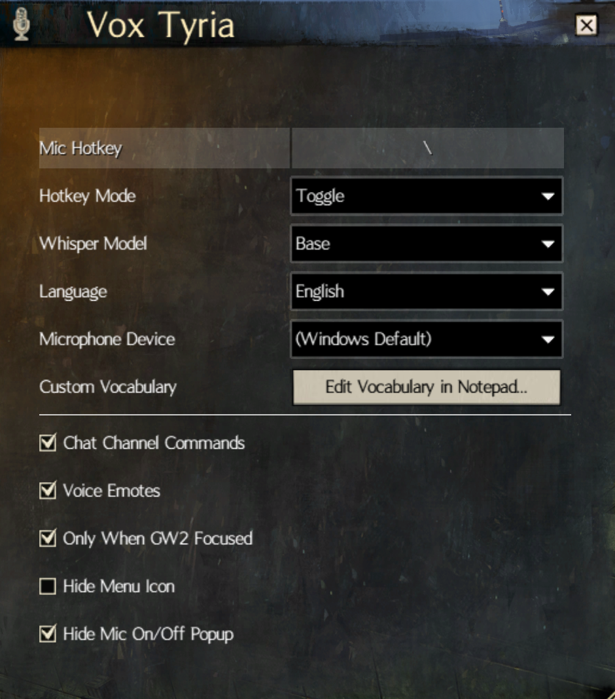

# Vox Tyria

A [Blish HUD](https://blishhud.com/) module that lets you speak into your microphone and have your words typed directly into the Guild Wars 2 chat box — no typing required.

---

## How it works

1. Press your configured **mic toggle key** (default: **F10**) to start recording, then press again to stop — or hold in **Push-to-talk** mode.
2. Your speech is transcribed locally using [OpenAI Whisper](https://github.com/openai/whisper) (via [Whisper.net](https://github.com/sandrohanea/whisper.net)) and injected into the GW2 chat input field.

No audio is sent to any external server — transcription happens entirely on your machine.

---

## Features

| Feature | Details |
|---|---|
| **Local speech-to-text** | Powered by whisper.cpp; runs fully offline after initial model download |
| **Automatic model download** | The required GGML model is downloaded on first use from Hugging Face and cached locally |
| **Voice channel routing** | Say a channel name at the start of your phrase to route it — e.g. *"map incoming at north"* sends `/map incoming at north` |
| **Voice emotes** | Say a single emote word — e.g. *"dance"* — to perform `/dance` in-game |
| **Custom vocabulary** | Bias transcription toward GW2 terms, guild tags, or player names |
| **Push-to-talk** | Choose between Toggle mode or hold-to-record Push-to-talk mode |
| **Microphone selection** | Pick a specific input device; auto-selects if only one is present |
| **GW2 focus guard** | Optionally restrict recording to when GW2 is the active window |
| **Multilingual** | 34 languages selectable from a dropdown; Auto mode detects language automatically |

---

## Settings

Click the Vox Tyria corner icon to open the settings window, or click **Open Vox Tyria Settings…** in the Blish HUD module panel.



| Setting | Default | Description |
|---|---|---|
| **Mic Hotkey** | `F10` | Keybind to start / stop recording |
| **Hotkey Mode** | `Toggle` | `Toggle`: press once to start, press again to stop. `PushToTalk`: hold to record, release to send |
| **Whisper Model** | `Tiny` | Speech recognition accuracy vs. speed — `Tiny` (fastest, ~75 MB), `Base` (~145 MB), or `Small` (best accuracy, ~460 MB) |
| **Language** | `Auto` | Language you'll be speaking. Auto detects automatically; picking a specific language improves accuracy |
| **Microphone Device** | *(Windows Default)* | Input device to record from. Defaults to the active Windows input device |
| **Custom Vocabulary** | GW2 terms | Comma-separated words/phrases used to bias the transcription toward GW2 jargon. Click **Edit Vocabulary in Notepad…** to edit |
| **Chat Channel Commands** | `on` | Prefix your phrase with a channel name to route to that channel |
| **Voice Emotes** | `on` | Say a single emote word to perform it in-game |
| **Only When GW2 Focused** | `on` | Ignore the keybind unless GW2 is the foreground window |
| **Hide Menu Icon** | `off` | When checked, hides the Vox Tyria icon from the corner icon tray. The module keeps working |
| **Hide Mic On/Off Popup** | `off` | Suppress the on-screen notification when recording starts/stops (errors always shown) |

---

## Voice channel commands

When **Chat Channel Commands** is enabled, start your phrase with a supported channel name:

| Say | Sends |
|---|---|
| *"map incoming at north"* | `/map incoming at north` |
| *"say hello"* | `/say hello` |
| *"yell for the memes"* | `/yell for the memes` |
| *"squad ready check"* | `/squad ready check` |
| *"party start without me"* | `/party start without me` |
| *"guild good fight"* | `/guild good fight` |
| *"whisper John hey"* | `/whisper John hey` |

Short aliases also work: `g` (guild), `s` (say), `t` (team), `p` (party), `m` (map), `y` (yell), `w` (whisper).

---

## Corner icon

The module adds a mic icon to the Blish HUD corner icon tray. **Click it to open the Vox Tyria settings window.**

While recording is active the icon enlarges and pulses. Hover over the icon at any time to see the module's current status as a tooltip.

| Tooltip | Meaning |
|---|---|
| Initialising… | Module is starting up |
| Downloading model… | Whisper model is being fetched |
| Ready | Waiting for mic hotkey |
| Recording… | Recording in progress — icon is enlarged and pulsing |
| No microphone detected | No input device found |
| Model error — check log | Model download or load failed |

The icon can be hidden via **Hide Menu Icon** in the settings window. The module continues to work when the icon is hidden.

---

## Requirements

- **Blish HUD** `>= 0.11.8`
- A working microphone
- Windows (x64) — due to native whisper.cpp binaries

---

## Installation

> **Requirements:** [Blish HUD](https://blishhud.com/) must already be installed and running. No other downloads needed.

1. Go to the [Releases](https://github.com/MortalJohn/VoxTyria/releases) page and download `VoxTyria.bhm`.
2. Drop the file into your Blish HUD modules folder:
   ```
   Documents\Guild Wars 2\addons\blishhud\modules\
   ```
3. Restart Blish HUD (or click **Reload Modules** in the settings).
4. Go to **Settings → Modules**, find **Vox Tyria**, and enable it.
5. On first use the module will automatically download the Whisper speech model. The corner icon tooltip will change to **Ready** once it's ready.

That's it — press **F10** (configurable) to start recording, press again to send.

---

## Model sizes

| Model | Size | Speed | Notes |
|---|---|---|---|
| Tiny | ~75 MB | Fastest | Good for short chat phrases; default |
| Base | ~145 MB | ~2× slower | Noticeably better accuracy |
| Small | ~460 MB | ~4× slower | Best accuracy; worth it for complex sentences |

Quantised `Q8_0` versions are used to reduce file size and memory usage without meaningfully impacting quality for short utterances. The model is downloaded automatically on first use. Changing the model selection triggers a fresh download.

---

## Building from source

```
dotnet build -c Release
```

The output `.bhm` file is written to `bin/Release/net472/`.
